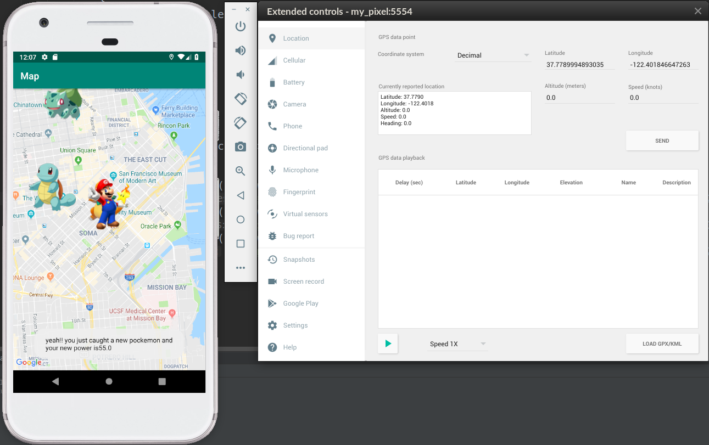

# Pokemon_Go
## An android game similar to pokemon go  !!

### How it works?
Basically the app randomly place some pokemons in the map and it also fetches user's real time location; So if user wants to cature the pokemon he has to go the same latitude and longitude where pokemon is placed.Player's power also gets add up after each successful capture depeding upon the strength of the pokemon.
### UI of the app  
### ->

Now lets say If player(user) wants to capture "Charmander", then he'll have to move to the same location where the pokemon is placed in the map and it automatically gets captured.As you can see 37.7866(lat) and -122.420(long) is my initial position and the charmander is placed at 37.7789994893035(lat) and -122.401846647263(long), So when the player will move to this location, the pokemon automatically gets captured and your power increases by the strength provided by the pokemon.  

  
### Once the "charmander" got captured, it gets removed from the view(map).
  
### ->

